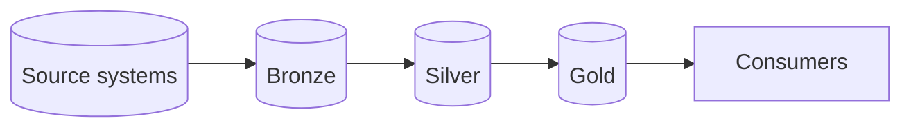

# Architecture

> Update this page at the end of every lesson. It is the diagram you present at
> the oral defence.

## Context

What Albert's Marketplace needs from its data platform, in three to five
sentences: who uses the data, for what, how fresh it must be, and under which
constraints.

## Target architecture

Replace this placeholder with your group's diagram. Name each technology once
your group has chosen it, and link the ADR that chose it.

## Layers

| Layer | What lands here | What it guarantees | Who reads it |
|---|---|---|---|
| Bronze | | | |
| Silver | | | |
| Gold | | | |

## Decisions

| ADR | Decision | Status |
|---|---|---|
| [0001](adr/0001-target-architecture.md) | | |

## Change log

| Lesson | What changed |
|---|---|
| L01 | First version |
