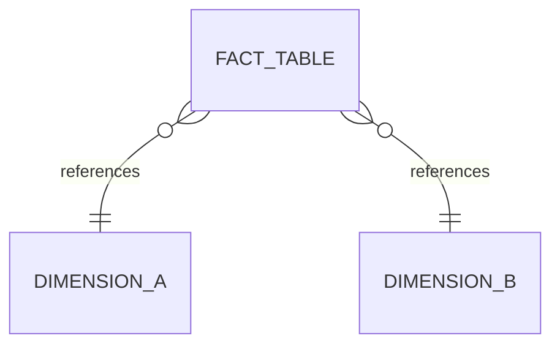

# Dimensional model

Sketch each star schema here before building it. You build them for real in L05.

For every fact table, write these four things **in this order:**

1. **Business process:** the operation it measures.
2. **Grain:** one sentence, "one row per …". Decide it first; every count
   depends on it.
3. **Dimensions:** the context you filter and group by.
4. **Facts:** the numbers, and whether each one can be summed.

A sketch can be a Mermaid diagram, which GitHub renders:

